# 字典 和 哈希表（Dictionary ＆ Hash-Table）

## 字典

- 主要特点一一对应的关系
- 字典中的 key 是不可以重复的，而 value 可以重复，并且字典中的 key 是无序的

## 哈希表

结构就是数组，但是神奇的地方在于对下标值的一种变换，这种变换可以称之为**哈希函数**，通过哈希函数可以获取到**HashCode**

### 优势

哈希表通常是基于数组进行实现的，但是相对于数组，它也有很多优势

- 可以提供**非常快速**的插入-删除-查找操作
- 无论多少数据，插入和删除值都需要接近常量的事件：即 O(1) 的时间级。实际上，只需要**几个机器指令**即可完成
- 哈希表的速度**比树还要快**，基本可以瞬间查找到想要的元素
- 哈希表相对于数来说编码要容易很多

### 不足

- 哈希表中的数据是**没有顺序**的，所以不能以一种固定的方式（如从大到小）来遍历其中的元素
- 通常情况下，哈希表中的 key 是**不允许重复**的，不能放置相同的 key，用于保存不同的元素

### 概念

**哈希化**：将**大数字**转换成**数组范围内下标**的过程，称之为哈希化

**哈希函数**：将**单词**转成**大数字**，**大数字**再进行**哈希化**的代码实现放在一个函数中，这个函数就称之为哈希函数

**哈希表**：最终将数据插入到这个数组，对整个结构的封装，就称此为哈希表

### 冲突解决方案

#### 链地址法（拉链法）

每个数组的单元格中存储的不再是单个数据，而是一条**链条**。该链条的数据结构可以是数组也可以是链表

在**插入**数据时候可以根据业务需求把元素插入到链条的首端或者末端；在**查询**时，先根据哈希化后的下标值找到对应的位置，取出链条，依次进行**线性查找**到数据

#### 开放地址法

主要工作方式：寻找**空白单元格**来放置冲突的数据项

根据探索此空白位置方式，可以划分为三种方法：

**线性探测**

- 插入数据：经过哈希化的得到下标值 **index** ，发现在 **index** 位置已存在数据，则在 **index** 基础上 **+1** 开始一步步查找到空白的位置，然后插入数据
- 查询数据：经过哈希化的得到下标值 **index** ，检查在 index 的位置的数据与查询的数据是否相同，如果相同则返回，不同则继续进行线性查找。当遇到空白位置时，则停止查找，返回查找失败（未找到）。
- 删除数据：与插入和查询类似，只是对删除数据所在位置的内容设置为 **-1** ，这样可以在插入或者查询时得知该位置是删除数据的位置，而不要将删除数据的位置置为 **null**
- 问题：可能产生**聚集问题**，影响到哈希表的性能

> 如果插入的数据是`22,23,24,25`，则意味下标值为`2,3,4,5`的位置都有元素，后面再插入`32`时会发现有一段连续的单元不允许放置数据，在此过程中就需要进行多次探索。前面的出现的问题就是**聚集**问题。

**二次探测**

主要是在线性探测基础上进行优化

- 线性探测可以看成是步长为 1 的探测，遇到已存放数据的位置都是 index + 1进行探测；而二次探测，对步长进行了优化，每次探测下标值为：index + 12 , index + 22 , index + 32 。这样就可以一次性探测较长距离

- 问题：可能产生**步长不一**的一种**聚集**

**再哈希法**

- 产生一种依赖关键字的探测序列，而不是每个关键字都相同；那么，不同关键字即使映射到相同的数组下标，也可以使用不同的探测序列
- 做法：把关键字用另外一个哈希函数，**再做一次哈希化**，用这次哈希化的结果作为步长；对于指定的关键字，步长在整个探测中是不变的，不过**不同关键字使用不同的步长**
- 特点：
  1. 和第一个哈希函数不同
  2. 不能输出为 0 ，否则将没有步长陷入死循环
- 哈希函数：**`stepSize = constant - (key % constant)`**，其中 `constant` 是质数，且少于哈希表容量

### 哈希化的效率

哈希表中执行**插入**和**探索**操作效率是**非常高**的

- 如果没有产生冲突，效率就会非常更高
- 如果发生冲突，存取时间就依赖后来的探测长度
- 平均探测长度以及平均存取时间，取决与**装填因子**，随着装填因子变大，探测长度也会越来越长

**装填因子（load factor）**：哈希表中已经包含数据项和整个哈希表长度的比值
$$
装填因子 = 总数据项 / 哈希表长度
$$

+ 开放地址法：装填因子**最大是 1** ，因为必须寻找到空白单元格才能将元素插入
+ 链地址法：装填因子可以**大于 1** ，因为可以通过链条无限延伸下去

### 优秀的哈希函数

快速计算：

- 哈希表的优势在于效率，所以快速获取到对于的 hashCode 非常重要

- 需要通过快速计算来获取到元素的对应 hashCode

  > 使用 **霍纳法则** 对多项式进行优化，也称之为 秦九韶算法

均匀分布：

- 哈希表中，无论是链地址法还是开放地址法，当多个元素映射到同一个位置时，都会影响效率

- 优秀的哈希函数应该尽可能将元素映射到不同的位置，让元素在哈希表中均匀分布

  > 在使用常量的地方，尽量使用**质数**，比如：哈希表长度、N次幂的质数

