# 树（Tree）

## 树的特点

1. 树通常由一个**根**，连接着根的是**树干**
2. 树干到上面之后会进行分叉成**树枝**，树枝还会分叉成更小的**树枝**
3. 在树枝的最后是**叶子**

## 树结构的优点

## 树的术语

- 树（tree）：n > （n ≥ 0）个节点构成的**有限集合**；当 n = 0 时，称之为**空树**
- 对于任一棵非空树（n > 0），它具备以下性质：
  - 树中有一个称为“根（root）”的特殊节点，用 r 表示
  - 其余节点可分为 m （m > 0）个互不相交的有限集 T1 ，T2 , ... , Tm，其中每个集合本身又是一棵树，称为原来树的“子树（subtree）”
- 节点的度（degree）：节点的**子树个数**
- 树的度：树的所有节点中**最大的度数**
- 叶节点（leaf）：度为 0 的节点
- 父节点（parent）：有子树的节点是其子树的根节点的父节点
- 子节点（child）：若 A 节点是 B 节点的父节点，则称 B 节点是 A 节点的子节点；子节点也称之为孩子节点
- 兄弟节点（sibling）：具有同一父节点的各节点彼此是兄弟节点
- 路径和路径长度：从节点 n1 到 nk 的路径为一个节点序列 n1 ,  n2  , ...  ,nk , ni 是  ni + 1 的父节点，路径所包含边的个数为路径的长度
- 节点的层次（level）：规定**根节点在第 1 层**，其它任一节点的层数是其父节点的层数加 1 
- 树的深度（depth）：树中所有节点中的**最大层次**是这棵树的深度

## 树的遍历

树的遍历常见的四种方式：

**先序遍历**：

1. 访问根节点
2. 先序遍历其左子树
3. 先序遍历其右子树

**中序遍历**：

1. 中序遍历其左子树
2. 访问根节点
3. 中序遍历其右子树

**后序遍历**：

1. 后序遍历其左子树
2. 后序遍历其右子树
3. 访问根节点

**层序遍历**：

1. 按层从上到下，每层按一定顺序对树的节点进行遍历

## 二叉树

### 概念

如果树中的每个节点最多只能有两个子节点，这样的树就称之为“二叉树”

**定义**

1. 二叉树可以为空
2. 若不为空，则它是由根节点和称为其左子树 TL 和右子树 TR 的两个不相交的二叉树组成

**二叉树的五种形态**

**二叉树的特性**

1. 一棵二叉树第 i 层的最大节点数为：2(i-1)，i ≥ 1
2. 深度为 k 的二叉树有最大节点总数为：2k-1，k ≥ 2
3. 对任何非空二叉树 T ，若 n0 表示叶节点的个数，n2 是度为 2 的非叶节点个数，那么两者满足关系 n0 = n2 + 1

### 完美二叉树

完美二叉树（Perfect Binary Tree），也称为满二叉树（Full Binary Tree）

在二叉树中，除了最下一层的叶节点外，每层节点都有 2 个子节点，就构成了满二叉树

### 完全二叉树

完全二叉树（Complete Binary Tree），除了二叉树最后一层外，其它各层的节点数都达到最大个数，且**最后一层从左向右**的叶节点**连续存在**，只缺右侧若干叶节点

完美二叉树是特殊的完全二叉树

> 上面的二叉树如果**缺少** D 或 E 任一一个叶节点就不是完全二叉树

### 二叉搜索树

二叉搜索树（BST，Binary Search Tree），也称为二叉排序树或二叉查找树

二叉搜索树是一棵二叉树，可以为空；如果不为空，需满足以下性质：

- 非空左子树的所有键值小于其根节点的键值
- 非空右子树的所有键值大于其根节点的键值
- 左、右子树本身也都是二叉搜索树

二叉搜索树**特点**：

- 相对较小的值总是保存在左节点上，相对较大的值总是保存在右节点上
- 二叉搜索树**中序遍历**的结果是有序的
- 可以**快速地**找到给定关键字的数据项，并且可以快速地**插入和删除数据项**

二叉搜索树的**缺陷**：

- 如果插入的数据项是有序的数据，则会导致插入的数据左右分布不均匀

## 二叉平衡树

比较好的二叉搜索树数据应该是左右分布均匀的，但是插入连续的数据后，分布不均匀，称这种树为**非平衡树**

- 对于一棵平衡二叉树来说，插入和查找等操作的效率是 O(logN)
- 对于一棵非平衡二叉树，相对于编写了一个链表，查找效率变成了 O(N)

为了能以较快的时间  O(logN) 来操作一棵树，需要保证树总是平衡的，至少保证大部分是平衡的，那么时间复杂度也是接近  O(logN) 的；也就是说树中的每个节点左边的子孙节点的个数，应该尽可能的等于右边的子孙节点的个数

### 常见的二叉平衡树

**AVL树**

AVL （Adelson-Velskii-Landi）树是最早的一种平衡树，其有些办法保持树的平衡（每个节点多存储了一个额外的数据）

- 因为 AVL 树是平衡的，所以时间复杂度也是  O(logN)
- 但是，每次插入和删除操作相对于红黑树的效率都不高，所以整体效率不如红黑树

**红黑树**

红黑树（Red Black Tree）也是通过一些特性来保持树的平衡

- 因为红黑树是平衡的，所以时间复杂度也是  O(logN)
- 另外，插入和删除等操作，红黑树的性能都要优于 AVL 树，所以现在平衡树的应用基本都是红黑树

### 红黑树

#### 红黑树的规则

红黑树，除了符合二叉搜索树的基本规则外，还添加了以下的性质：

1. 节点是红色或黑色
2. 根节点是黑色
3. 每个叶子节点都是黑色的空节点（NIL 节点）
4. 每个红色节点的两个子节点都是黑色（从每个叶子到根的所有路径上不能有两个连续的红色节点）
5. 从**任一节点**到其**每个叶子**的所有路径都包含**相同数目的黑色节点**

#### 红黑树的相对平衡

上面的约束，确保了红黑树的关键特性：

- 从**根到叶子**的**最长可能路径**，不会超过**最短可能路径的两倍长**

为什么可以做到 **最长可能路径不会超过最短可能路径的两倍长**

1. 性质4 决定了路径不能有两个相连的红色节点
2. 最短的可能路径都是黑色节点
3. 最长的可能路径是红色和黑色交替
4. 性质5 所有路径都有相同数目的黑色节点，表明了没有路径能多余任何其它路径的两倍长

> 1. 假设某一路径只有黑色节点 n 个，没有红色节点，该路径长为 n，根据性质5，其他每个路径上也只有 n 个黑色节点加红色节点
> 2. 根据性质2和性质3，头尾两个节点是黑色，根据性质4，路径上红色节点不会连续出现，所以红色节点会和黑色节点交替出现，红色节点最多有 n-1 个
> 3. 所以此时最短路径为只有黑色的路径，长度 n，最长路径为红黑交替的路径，长度 **n + n - 1 = 2n - 1**，于是最长路径不会超过最短路径 2 倍

#### 红黑树变换

插入一个新节点时，有可能树不再平衡，可以通过三种方式的变换，让树保持平衡：

- 重新填色
- 左旋转
- 右旋转

**重新填色**：

为了重新符合红黑树的规则，尝试把**红色节点**变成**黑色**，或者把**黑色**节点变为**红色**

首先，插入**新的节点**通常都是**红色**节点，这是因为在**插入节点为红色**的时候，有可能插入一次是**不违反**红黑树任何规则的；而**插入黑色节点**，必然会导致有一条路径上**多了黑色节点**，这是很难调整的；红色节点可能导致出现**红红相连**的情况，但是这种情况可以通过**颜色调换**和**旋转**来调整

**左旋转**：

**逆时针**旋转红黑树的两个节点，使得父节点被自己的右孩子取代，而自己成为自己的左孩子

图中，身为右孩子的 Y 取代了 X 的位置，而 X 变成了 Y 的左孩子

**右旋转**：

**顺时针**旋转红黑树的两个节点，使得父节点被自己的左孩子取代，而自己成为自己的右孩子

图中，身为左孩子的 Y 取代了 X 的位置，而 X 变成了 Y 的右孩子

> 左旋转和右旋转对其子树**没有影响**

#### 红黑树插入操作

设要插入的节点为 N ，其父节点为 P ，其祖父节点为 G ，其父亲的兄弟节点（叔叔节点）为 U 

**情况一**：

- **情况**：新节点 N 位于树的根上，没有父节点
- **操作**：直接将红色换成黑色即可，就可以满足*性质四*

**情况二**：

- **情况**：新节点的父节点 P 是黑色；*性质四* 没有失效（新节点是红色的），*性质五* 也没有任何问题

- **备注**：尽管新节点 N 有两个黑色的叶子节点 NIL ，但是新节点 N 是红色，所以通过它的路径中黑色节点的个数依然相同，满足*性质五*

**情况三**：

- **情况**：新节点 N 的父节点 P 是红色，其叔叔节点 U 也是红色
- **技巧**：父红叔红祖黑 --> 父黑叔黑祖红
- **操作**：
  1. 将父节点 P 变换为黑色，其叔叔节点 U 变换为红色
  2. 现在新节点 N 有了一个黑色的父节点 P ，所以每条路径上黑色节点的数目没有改变
  3. 而从更高的路径上，必然都会经过 G 节点，所以那些路径的黑色节点数目也是不变的，符合*性质五*
- **可能出现问题**：新节点 N 的祖父节点 G 的父节点也可能是红色的，这就违法了*性质三* ，可以**递归的调整颜色**；但是如果递归调整颜色到了根节点，就需要进行旋转了

**情况四**：

- **情况**：新节点 N 的叔叔节点 U 是黑色节点，且新节点 N 是**左孩子**
- **技巧**：父红叔黑祖黑，N是左儿子 ---> 父黑祖红右旋转
- **操作**：
  1. 对祖父节点 G 进行依次右旋转
  2. 在旋转树中，以前的父节点 P 现在是新节点 N 以及以前祖父节点 G 的父节点
  3. 交换以前的父节点 P 和祖父节点 G 的颜色（P变为黑色，G变为红色）
  4. B 节点向右平移，称为祖父节点 G 的左子节点

**情况五**：

- **情况**：新节点 N 的叔叔节点 U 是黑色节点，且新节点 N 是**右孩子**
- **技巧**：
  - 父红叔黑祖黑，N是右儿子 ---> 
  - 以 P 为根，左旋转（将 P 作为新插入的红色节点考虑即可）
  - 自己 N 变成黑色
  - 祖父节点 G 变成红色
  - 以祖父节点 G 为根，进行右旋转
- **操作**：
  1. 对父节点 P 进行左旋转，形成*情况四* 的结果
  2. 对祖父节点 G 进行一次右旋转，并且改变颜色即可
